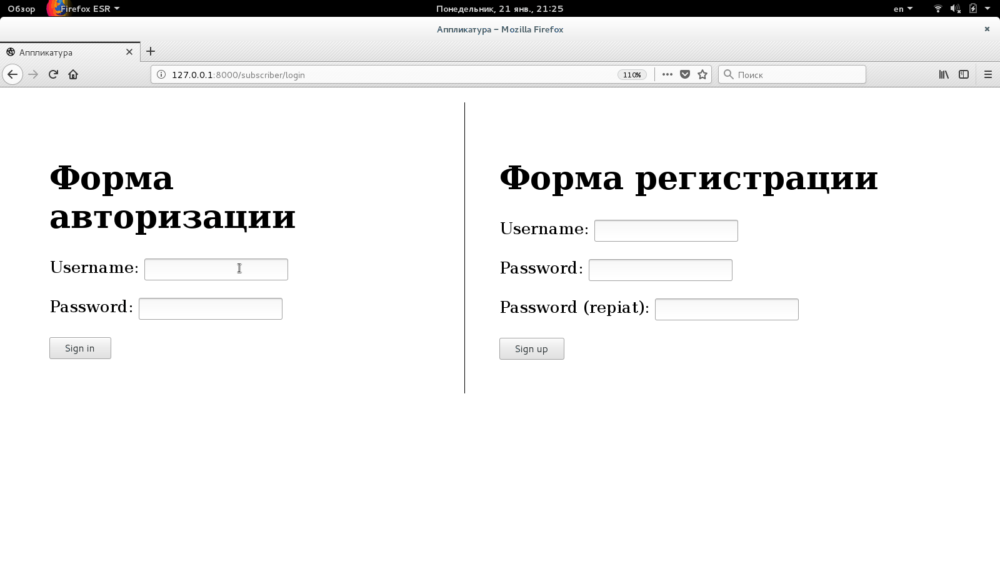

# INDEX page

Проект сайта курсов дистанционного обучения (открытые уроки музыки)

## Описание

### Требования

Установите:

```bash
$ pip3 install -r requirements.txt
```

### Результаты ДЗ занятия 7 (прикручен бэкэнд) 

#### Dev

```bash
python3 ./manage.py migrate --settings=applicatura.settings.dev
python3 ./manage.py init_test_data --settings=applicatura.settings.dev

python3 ./manage.py createsuperuser --username=admin --email=admin@admin.admin  --settings=applicatura.settings.dev
python3 ./manage.py runserver --settings=applicatura.settings.dev
```

#### Production

```bash
python3 ./manage.py migrate --settings=applicatura.settings.prod
python3 ./manage.py init_test_data --settings=applicatura.settings.prod

python3 ./manage.py collectstatic --settings=applicatura.settings.prod
python3 ./manage.py createsuperuser --username=admin --email=admin@admin.admin  --settings=applicatura.settings.prod
python3 ./manage.py runserver --settings=applicatura.settings.prod
```

Предупреждаю: цветопередача скринкаста просто жутчайшая. Но и я, конечно, не "художник" )

#### Как этим управляет админ


#### Как это видит пользователь


  
#### Личный кабинет (список подписок)



#### Результат

Итого:
* http://localhost:8000 - интерфейс пользователя 
* http://localhost:8000/just_for_me - стандартная админка Django 

### Результаты ДЗ занятия 8 (прикручен REST API) 

Открытая часть:
* http://localhost:8000/rest_api/course/list - список курсов
* http://localhost:8000/rest_api/course/1 - курс подробно с уроками
* http://localhost:8000/rest_api/lesson/1 - урок подробно

Закрытая часть:
* http://localhost:8000/rest_api/subscriber/create - создание учетки подписчика
* http://localhost:8000/rest_api/subscriber/login - авторизация подписчика
* http://localhost:8000/rest_api/subscriber/current - информация о текущем пользователе\подписчике
* http://localhost:8000/rest_api/subscriber/logout - оказывается это целая проблема JWT-logout, решают топорно, 
через введение UUID-поля токена пользователя, так что тут у меня Sessions
* http://localhost:8000/rest_api/subscriber/lesson/list - уроки подписчика
* http://localhost:8000/rest_api/lesson/1/subscription/check - проверка на наличие подписки
* http://localhost:8000/rest_api/lesson/1/subscription/change - изменение статуса подписки

Только для админа :
* http://localhost:8000/rest_api/subscription/list - подписки всех на все 
* http://localhost:8000/rest_api/lesson/list - список всех уроков

#### REST API


### Результат

Имеем три точки входа:
* http://localhost:8000 - интерфейс пользователя 
* http://localhost:8000/just_for_me/ - стандартная админка Django 
* http://localhost:8000/rest_api/ - REST API

## Авторы

* **BorisPlus** - [https://github.com/BorisPlus/otus_webpython_013](https://github.com/BorisPlus/otus_webpython_013)

## Лицензия

Свободно

## Дополнительные сведения

Проект в рамках домашнего задания курса "Web-разработчик на Python" на https://otus.ru/learning

python3 manage.py createsuperuser --username=admin --email=admin@admin.admin
